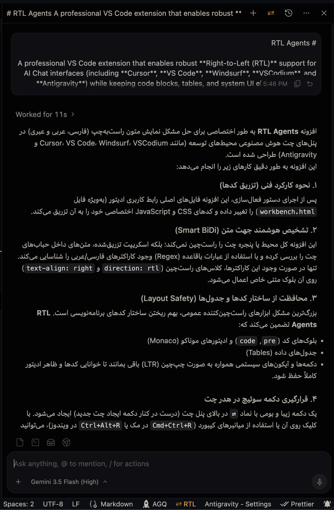

# ⇄ RTL Agents

A professional VS Code extension that enables robust **Right-to-Left (RTL)** support for AI Chat interfaces (including **Cursor**, **VS Code**, **Windsurf**, **VSCodium**, and **Antigravity**) while keeping code blocks, tables, and system UI elements properly aligned in **Left-to-Right (LTR)**.

Specifically optimized for **Persian**, **Arabic**, and **Hebrew** languages.

---

<p align="center">
  
</p>

---

## ✨ Key Features

*   **🌐 Multi-IDE Support**: Automatically detects and patches active IDE resources for VS Code, Cursor, Windsurf, VSCodium, and Antigravity.
*   **⚡ Smart Bidirectional (BiDi) Text Alignment**: Does not flip the entire editor window. It scans text inside chat bubbles and shifts only the elements containing RTL characters (Persian/Arabic/Hebrew) to the right.
*   **🛡️ Code Block & Layout Safety**: Keeps code syntax blocks (`pre`, `code`), Monaco editors, data tables, SVG icons, and action buttons in LTR, ensuring your coding workspace remains intact.
*   **⇄ Seamless Header Integration**: Places a beautiful toggle button (`⇄`) directly inside the chat panel header (next to the "New Chat" button). It matches the theme and button design of your editor.
*   **💾 Persistency**: Saves your toggled preference in the editor sandbox `localStorage` so it persists across reloads and new window sessions.
*   **🔑 Checksum Bypass**: Removes workbench checksum keys from `product.json` to prevent the IDE from triggering the annoying `[Unsupported]` or "Installation is corrupt" warning.
*   **⚙️ Custom Selectors & Configuration**: Customize target CSS selectors and the RTL character detection regex patterns directly in VS Code settings.
*   **🔄 Auto-Reactivation**: Detects editor updates and automatically prompts you to re-apply the patch in one click.

---

## 🚀 Getting Started

Because this extension modifies the workbench UI elements on disk to enable deep integration, it requires a simple, one-time activation.

1.  Open the Command Palette (`Ctrl+Shift+P` on Windows/Linux or `Cmd+Shift+P` on macOS).
2.  Type and run: **`RTL Agents: Activate RTL`**.
3.  **Fully quit and restart** your IDE (doing a simple "Reload Window" is not enough).
4.  Open your AI Chat and enjoy proper RTL alignment!

> [!TIP]
> **Permission Denied on macOS/Linux?**
> This is normal since editor files on disk are write-protected. Running the command will output a copyable shell fix command (e.g., `sudo chown ...`). Copy it, run it in your Terminal, then run `RTL Agents: Activate RTL` again.

---

## ⚙️ Configuration

You can customize the extension via your `settings.json`:

```json
{
  "rtl-agents.customSelectors": [
    ".my-custom-chat-element p",
    "div[class*=\"custom-message\"] li"
  ],
  "rtl-agents.rtlCharacterRegex": "[\\u0590-\\u05FF\\u0600-\\u06FF\\u0750-\\u077F\\u08A0-\\u08FF]"
}
```

*   `rtl-agents.customSelectors`: List of additional CSS selector patterns you want to monitor for RTL text.
*   `rtl-agents.rtlCharacterRegex`: Customize the regular expression used to trigger RTL matching.

---

## 🛠️ Commands

| Command | Shortcut | Description |
| :--- | :--- | :--- |
| **`RTL Agents: Activate RTL`** | - | Injects the CSS/JS and removes checksums. |
| **`RTL Agents: Deactivate RTL`** | - | Restores the IDE files back to their clean original states. |
| **`RTL Agents: Toggle RTL/LTR`** | `Ctrl+Alt+R` / `Cmd+Ctrl+R` | Toggles the active status on the fly. |
| **`RTL Agents: Check Status`** | - | Displays the patch status of all installations in an output channel. |
| **`RTL Agents: Restart RTL`** | - | Restores original files first, then re-applies the patch. |

---

## 📄 License

MIT © [Foshati](https://github.com/Foshati)
