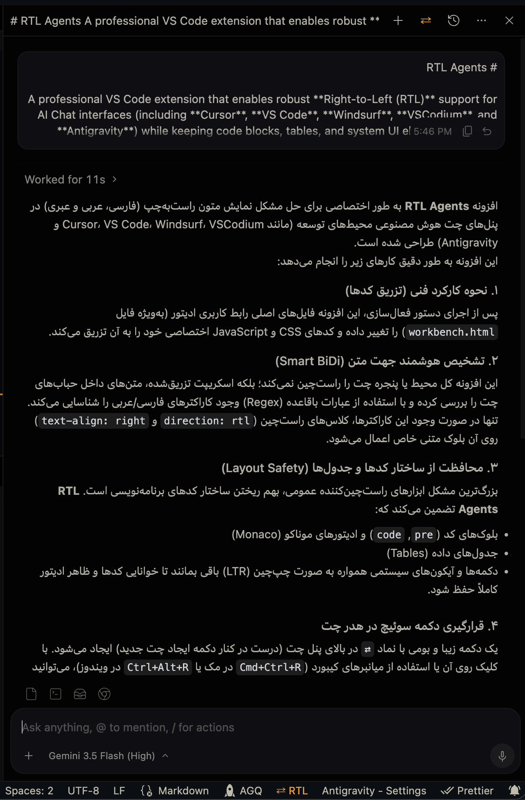

# ⇄ RTL Agents

A professional VS Code extension that enables robust **Right-to-Left (RTL)** support for AI Chat interfaces (including **Cursor**, **VS Code**, **Windsurf**, **VSCodium**, and **Antigravity**) while keeping code blocks, tables, and system UI elements properly aligned in **Left-to-Right (LTR)**.

Specifically optimized for **Persian**, **Arabic**, and **Hebrew** languages.

---

<p align="center">
  
</p>

---

## ✨ Key Features

*   **🌐 Multi-IDE Support**: Automatically detects and patches every workbench document of the running IDE — VS Code, Cursor, Windsurf, VSCodium, and Antigravity (including Antigravity's separate agent window).
*   **⚡ Native Bidirectional (BiDi) Alignment**: Direction is resolved by the browser itself, per paragraph, from the first strong directional character — `unicode-bidi: plaintext`. A Persian paragraph goes right, an English one stays left, inside the same reply.
*   **✨ Zero Flicker While Streaming**: Because alignment is pure CSS, it is applied at layout time, before the first paint. Streamed text never renders LTR and then jumps. There is no per-word JavaScript, no document-wide `MutationObserver`, and no measurable CPU cost while a reply is generating.
*   **🛡️ Code Block & Layout Safety**: `pre`, `code`, Monaco editors, and table column order stay LTR, so your coding workspace and any code inside a Persian sentence remain readable.
*   **⇄ Seamless Header Integration**: Places a toggle button (`⇄`) directly inside the chat panel header, next to the "New Chat" button, borrowing its styling. The status bar item and the header button always agree.
*   **💾 Persistency**: Remembers your preference across reloads, and keeps every patched window in sync instantly.
*   **🔑 Checksum Bypass**: Removes the relevant workbench checksum keys from `product.json` to prevent the `[Unsupported]` / "Installation is corrupt" warning, restoring them exactly on deactivation.
*   **♻️ Clean Uninstall**: Deactivating removes the toggle button immediately, and restores every patched file byte for byte. A backup left over from an older IDE build is never written over a newer one.
*   **🔄 Auto-Reactivation**: Detects editor updates and re-applies the patch, prompting for a restart.

---

## 🚀 Getting Started

Because this extension modifies the workbench UI elements on disk to enable deep integration, it requires a simple, one-time activation.

1.  Open the Command Palette (`Ctrl+Shift+P` on Windows/Linux or `Cmd+Shift+P` on macOS).
2.  Type and run: **`RTL Agents: Activate RTL`**.
3.  **Fully quit and restart** your IDE (doing a simple "Reload Window" is not enough).
4.  Open your AI Chat and enjoy proper RTL alignment!

> [!TIP]
> **Permission Denied on macOS/Linux?**
> This is normal since editor files on disk are write-protected. Running the command will output a copyable shell fix command (e.g., `sudo chown ...`). Copy it, run it in your Terminal, then run `RTL Agents: Activate RTL` again.

---

## ⚙️ Configuration

You can customize the extension via your `settings.json`:

```json
{
  "rtl-agents.customSelectors": [
    ".my-custom-chat-panel",
    "div[class*=\"custom-message-list\"]"
  ]
}
```

*   `rtl-agents.customSelectors`: Additional **chat container** selectors. Text inside them picks its own direction per paragraph, exactly like the built-in containers. Changing this rewrites the injected stylesheet right away — no re-patch needed.

> [!NOTE]
> `rtl-agents.rtlCharacterRegex` is deprecated as of v2.0.0 and ignored. Direction is now resolved natively by the browser, so there is no character list to configure.

---

## 🛠️ Commands

| Command | Shortcut | Description |
| :--- | :--- | :--- |
| **`RTL Agents: Activate RTL`** | - | Injects the CSS/JS and removes checksums. |
| **`RTL Agents: Deactivate RTL`** | - | Restores the IDE files back to their clean original states. |
| **`RTL Agents: Toggle RTL/LTR`** | `Ctrl+Alt+R` / `Cmd+Ctrl+R` | Toggles the active status on the fly. |
| **`RTL Agents: Check Status`** | - | Displays the patch status of all installations in an output channel. |
| **`RTL Agents: Restart RTL`** | - | Restores original files first, then re-applies the patch. |

---

## 🧪 Development

```bash
pnpm install
pnpm build   # bundle the extension
pnpm test    # patch/unpatch round-trip and asset generation checks
pnpm lint
```

`pnpm test` exercises the patch layer against synthetic fixtures in a temp directory — it never touches a real IDE installation.

---

## 📄 License

MIT © [Foshati](https://github.com/Foshati)
